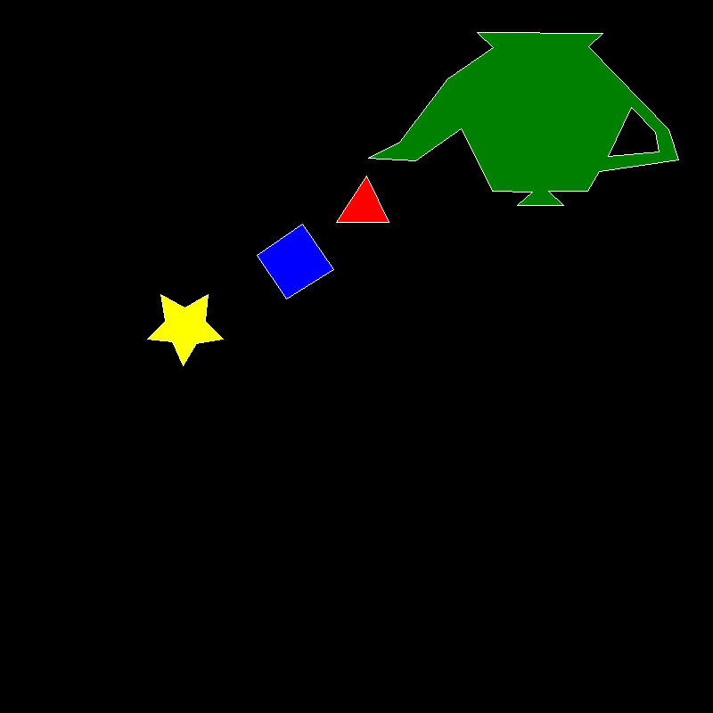

# 🖼️ Rust Polygon Rasterizer

This project is a simple **software rasterizer** written in **Rust** that:
- Uses **Bresenham’s algorithm** to draw lines
- Uses a **scanline fill algorithm** to fill polygons
- Generates output images in **PNG** and **BMP** formats

It’s a learning project to practice basic graphics programming and Rust fundamentals.

---

## 📂 Features

- Draw multiple polygons with any number of vertices
- Support for polygon holes
- Export to `.png` and `.bmp`
- Uses [`raylib`](https://www.raylib.com/) bindings for Rust (`raylib-rs`)

Example output:  


---

## ⚙️ Dependencies

You’ll need:

- **Rust** (installed via `rustup`)
- [`raylib`](https://crates.io/crates/raylib) Rust crate (`raylib = "3.7"` or newer)
- A **C compiler** and **CMake** to build `raylib-sys`  
  _(macOS: `brew install cmake`; Linux: `sudo apt install cmake`)_

---

## 📦 How to build & run

1. **Clone the repository:**

   ```bash
   git clone https://github.com/nilsmuralles/Lab1-Polygon
   cd Lab1-Polygon

1. **Build and run:**

   ```bash
   cargo run
